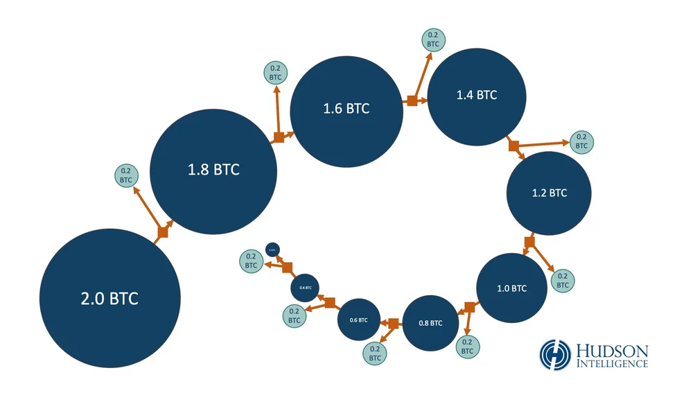
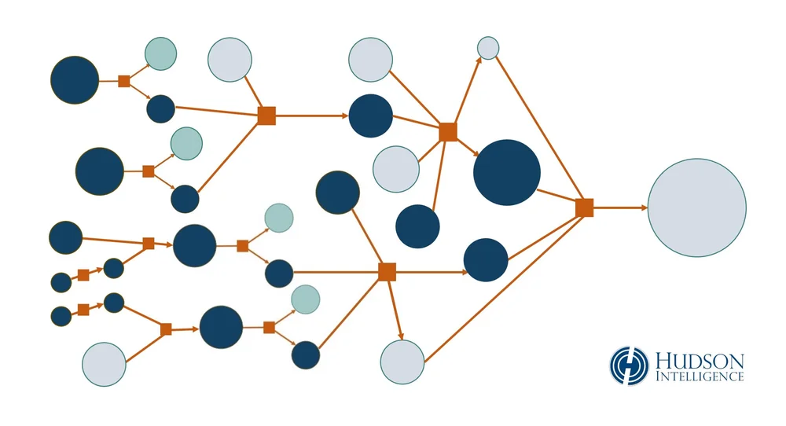
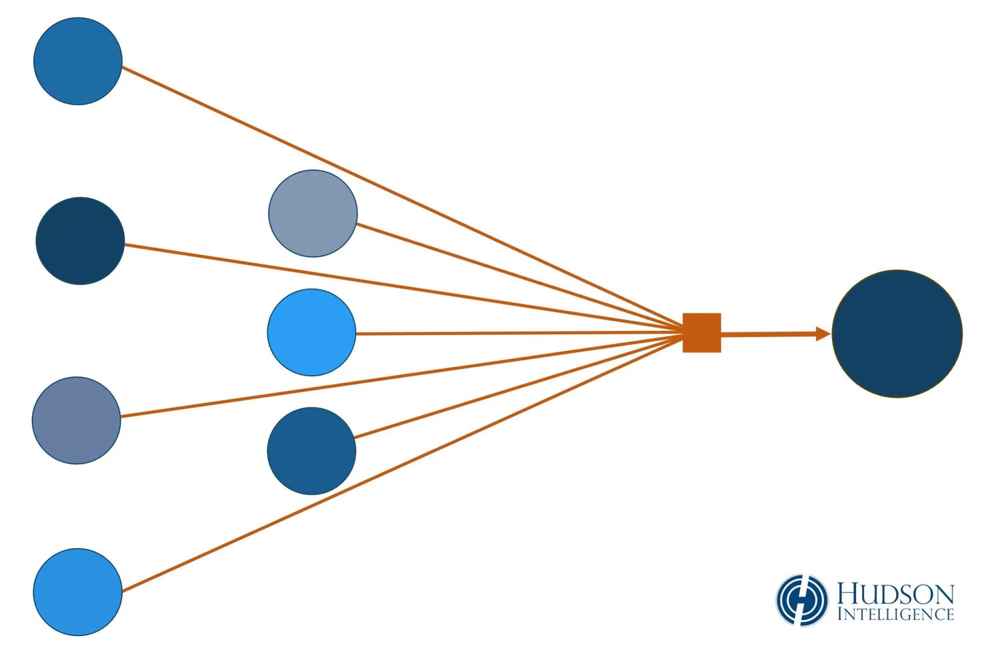
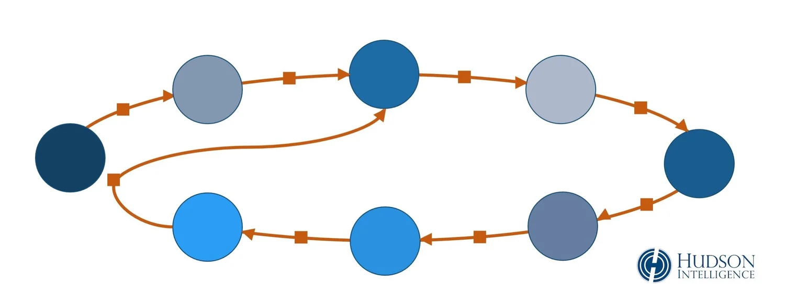
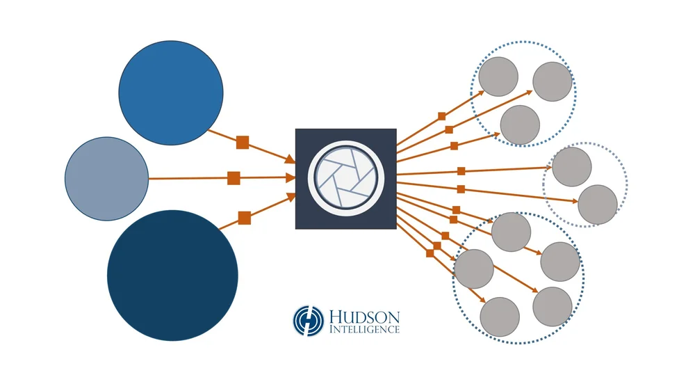

## Peel Chain

Peel chain is a technique to launder a large amount of cryptocurrency through a lengthy series of minor transactions. 

A small portion is ‘peeled’ from the subject’s address in a low-value transfer. These incremental outputs are often directed to exchanges where they can be converted to fiat currency (e.g., dollars) or other assets. The subject’s remaining UTXO passes to a new change address and the process repeats. 

Due to the small amounts of each individual transfer, outputs from the peel chain are less likely to raise red flags for AML compliance at virtual asset exchanges or trigger mandatory reporting to tax and regulatory authorities

An extremely simplified version of a peel chain without transactional fees, miscellaneous payments to third parties, or other complications that commonly arise during a cryptocurrency tracing investigation. 

This is also an example of a miniature peel chain. The peeling process can be automated by computer scripts and may extend for hundreds — or thousands — of transactions. 

## Layering

Layering is a technique for obscuring the origin and destination of illicit funds by adding extra levels of complexity to the transaction trail. Cryptocurrency is laundered through numerous transfers to intermediate addresses and third-party services, making it harder to trace the flow of funds.

Layering is a common practice for criminal perpetrators seeking to shield their identities and launder proceeds from fraud schemes, thefts, hacks, extortion rings and other illicit activity. 

A generalized, pared-down version of layering. Actual work product in a blockchain investigation would include cryptocurrency addresses and transaction hashes for every transfer, as well as ownership and attribution data, as available, for each relevant link in the chain.

### Layering and Laundering
Fraudsters and thieves layer transactions by transferring cryptocurrency through numerous intermediate addresses under their direct control. Cryptocurrency is also laundered through numerous third-party services, such as coin mixers, dark markets, online casinos, decentralized finance, and peer-to-peer exchanges. Many of these platforms lack KYC/AML controls to verify customer identities or the legitimacy of income/asset sources, making them ideal environments for money laundering. Moving funds through multiple opaque channels can make it more difficult for an outside observer to trace the flow of tainted assets.

## Common Spend
Common spend describes a heuristic, or method, used by blockchain investigators to identify other cryptocurrency addresses controlled by the same person or entity. It is also known as the Common Input Ownership Heuristic or Nakamoto/Meiklejohn Heuristic. 

In a common spend (or co-spending) transaction, multiple lesser-value input addresses are used to fund a higher-value transaction, similar to paying for something expensive with a handful of small bills and mixed coins. 

Using multiple input addresses in this manner typically requires shared access to their passwords, or private keys. People rarely relinquish their private keys to strangers, for the same reasons they protect their login credentials for online banking. Private keys convey authority over the assets. In a situation like the example above, an analyst may conclude all input addresses were likely controlled by the same party.

## Address Reuse

Address reuse in cryptocurrency transactions reduces privacy and anonymity. 

Reuse of an identical cryptocurrency address for multiple input/output transactions potentially creates an opportunity for blockchain observers to attribute that address — and possibly an entire string of intervening addresses — to a particular person. 

This example shows one-to-one transfers across a series of intermediary addresses as digital money moves from one address to the next in a loop-like rotation. At the end, an address seen earlier in the cycle is reused as an output address to receive the final transfer.

At minimum, an analyst would likely attribute the final six addresses within this loop to the same person. Linking multiple addresses to the subject of an investigation can significantly expand the field of evidence. 

In an actual blockchain investigation, this diagram and its underlying data would include hashes, fees, time/date stamps, attribution data, and other relevant information.

## Peer-to-Peer Exchange

Peer-to-peer (P2P) exchanges are online platforms for people to buy, sell, and trade cryptocurrencies with each other without the regulatory oversight and consumer protections of a major commercial exchange. 

A seller advertising on a P2P exchange will place the offered cryptocurrency in escrow through a smart contract. The coins are automatically released to the buyer once payment is received.

P2P exchanges include Paxful, Bitquick, LocalBitcoins, LocalCryptos and LocalCoinSwap.

### How are Peer-to-Peer Exchanges Used in Cryptocurrency Fraud?
P2P exchanges are often used by people who want to maximize their financial privacy or avoid scrutiny from government regulators, law enforcement and intelligence services. 

Purchases of cryptocurrency on a P2P exchange can be funded with a variety of payment options, including cash, prepaid cards and gift cards. Cash purchases create an extra layer of anonymity for the person acquiring the cryptocurrency, since the acquisition of these new assets will not appear in their banking records or credit card statements.

Compared to traditional exchanges, P2P exchanges typically require few (if any) steps to verify the identity of buyers and sellers. Proponents of P2P exchanges contend they do not need to comply with KYC/AML regulations because they are merely “facilitating” deals by connecting buyers and sellers, without processing any fiat payments or holding funds in their custody.

Although not all P2P transactions are illicit, the mix of cash payments and anonymous users make it easier to launder money and evade taxes. Peer-to-peer transactions may also occur ‘below the radar’ in countries that have banned cryptocurrency or commercial exchanges, such as China and Columbia.

## Mixer 
A mixer is an online service that pools cryptocurrency from multiple users, and then sends them ‘clean’ cryptocurrency in different sums, to obscure the audit trail of tainted funds.

These services are intended to prevent ‘tainted’ cryptocurrency from being tracked back to its original source – or traced forward to its ultimate destination – by obscuring the path of potentially identifiable transfers. Structuring transactions in this manner makes it more difficult for law enforcement and blockchain investigators to efficiently map the flow of funds from fraud schemes and criminal activity.

An illustration of multiple transactions with a mixing service, showing blockchain data in graphical format. This is a simplified version of how accounting entries are rendered by cryptocurrency intelligence tools during a tracing investigation. 

In this example, three individuals transfer their tainted cryptocurrency to a mixing service in amounts of 3 BTC, 2 BTC, and 5 BTC. (The largest depositor is shown in the lower left corner.) The mixer charges a 3% transaction fee. It then transfers the remaining pooled balance into 10 new addresses for its customers, in amounts proportional to their initial deposits. The largest customer walks away with 5 separate “clean” addresses, each containing 0.97 BTC. 

### Can Investigators Trace Transactions After They Hit a Mixer?
Mixers are less common than you might imagine. It can be difficult and costly to effectively dilute large amounts of cryptocurrency through these pools unless they are being fed by a steady stream of new customers. Pooling funds in this manner also puts users at risk of being ripped off by the same people who are supposed to be laundering their money. 

Darknet mixing services present other potential threats to their users and owners, having drawn intense scrutiny from federal prosecutors. The operator of Bitcoin (BTC) mixing service Helix was convicted on criminal charges of money laundering in the U.S. in August 2021, after pleaded guilty to laundering more than $300 million in cryptocurrency linked to drug trafficking and various other illicit activities. In May 2021, U.S. Internal Revenue Service Criminal Investigations (IRS-CI) arrested the alleged operator of mixing service Bitcoin Fog, who was indicted on charges of unlicensed money transmission and money laundering. Over the course of a decade, Bitcoin Fog allegedly laundered over 1.2 million bitcoin tied to illegal narcotics, computer fraud, and identity theft, according to prosecutors. Seizure of computer servers used to operate these mixing services presumably gives government investigators access to customer lists and financial records.

### What Kind of Service is CoinJoin?
CoinJoin is a privacy-enhancing Bitcoin transaction which combines inputs from numerous users and returns multiple outputs of identical values. Unlike other mixing services, users maintain custody of their funds throughout this process. 

The uniformity of outputs is intended to obscure ownership of each UTXO and defeat the heuristic-based clustering algorithms used by law enforcement and blockchain investigators.

For example, if four users input 2, 4, 6 and 8 BTC for a total of 20 BTC, the CoinJoin transaction would create 20 separate outputs each worth 1 BTC. The outputs would be apportioned to each user in the same amounts they originally contributed. Since every output has the same value, it should be impossible (in theory) to immediately discern which of the new bitcoin addresses are now controlled by each of the original four users.

## High-Risk Exchange
High-risk cryptocurrency exchanges are characterized by a lack of customer identity verification, transactional due diligence, and legal/regulatory compliance. 

Common traits of high-risk exchanges include:
- Failure to verify customer identities 
- Failure to follow Know Your Customer (KYC) guidelines 
- Failure to prevent the creation and use of fraudulent accounts
- Failure to respond to subpoenas and warrants
- Failure to file suspicious activity reports (SAR) or suspicious transaction reports (STR)
- Failure to comply with Anti-Money-Laundering (AML) and Anti-Terrorist-Financing (ATF) regulations
- Failure to prohibit participation by sanctioned parties (OFAC, HM Treasury)
- Failure to register as money transmitting business or money services business
- Failure to respond to record requests from foreign law enforcement (MLAT)

High-risk exchanges are often hosted on the dark web. They may be maintained in offshore jurisdictions with a history of tax havens and banking secrecy, or in foreign countries known for public corruption, weak judiciaries or lax regulations.

## Darknet Market

A darknet market is a website that facilitates the sale and exchange of illicit goods and services on the dark web. 

Cryptocurrency is commonly used on darknet markets due to its perceived anonymity and its ease and efficiency for transferring funds across international borders.

### The Rise of Bitcoin in the Darknet Economy
The infamous Silk Road market popularized Bitcoin as a preferred payment method for criminal activities, before being shut down by the Federal Bureau of Investigation in 2013. Ironically, evidence of cryptocurrency transfers — which many people believed to be totally anonymous — were used against the site’s operator during his criminal trial, where he was convicted on charges of money laundering and other offenses, and sentenced to life in prison. A federal prosecutor told the court: “At the end of the day, it is all based on public records showing one-to-one connections between Bitcoin addresses. It is not anything very complicated.” 

Since the demise of Silk Road, numerous markets have emerged on the dark web for transactions of hacked passwords, stolen credit cards, compromised accounts, money laundering and fraud-related services.

One of the most successful markets is Hydra, a Russian-language site known for strict privacy rules and high-volume narcotics, where transactions reportedly totaled more than $1.3 billion in 2020. Today, buyers and sellers on Hydra and other online black markets frequently transact in the cryptocurrency Monero (XMR) due to its heightened anonymity, according to analysts.

### What is the Dark Web?
The dark web is an anonymized overlay of the internet accessible through networks such as Tor ("The Onion Router"), I2P and Riffle that utilize layered encryption to obscure the identities and locations of users.

The dark web is commonly considered a haven for illicit and illegal activities, including hacker forums, drug trafficking, identity theft, and child pornography. 

Not all activity on the dark web is illegal. Its extra layer of encryption has afforded protection to activists in oppressive regimes fighting for civil rights and free speech. SecureDrop has been used by journalists to communicate with anonymous sources, and encrypted email service ProtonMail developed by MIT and CERN is another well-known denizen of the darknet. The CIA has its own ‘onion site’ on the Tor network, encouraging foreign intelligence sources to share secrets without fear of detection or reprisal.